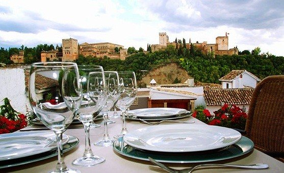
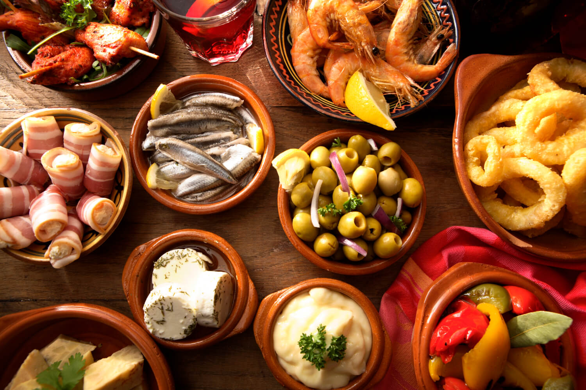
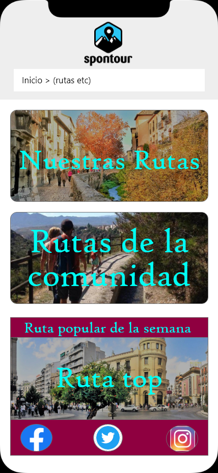
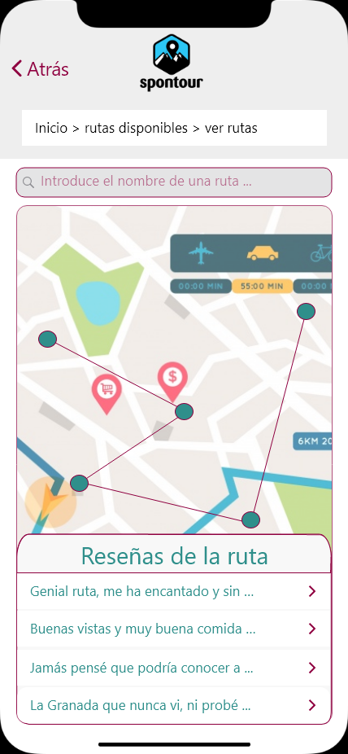
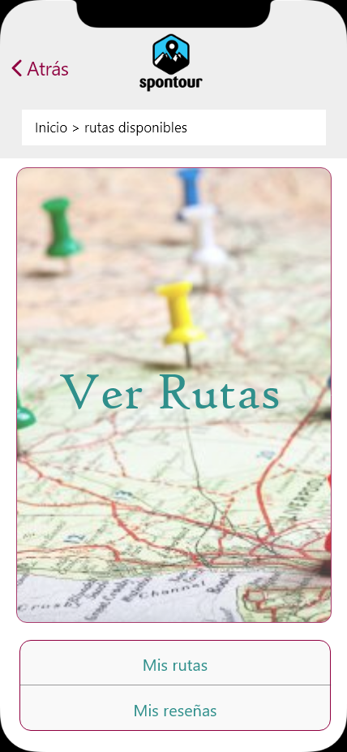

# DIU - Practica 3, entregables

 3.a Moodboard
-----
Para la creación del Moodboard utilizamos el siguiente sitio web donde puede consultar nuestro diseño: https://app.milanote.com/1LBKAK17SJQPes/spontour

>>>**Logotipo**
>>>

El logotipo de la aplicación lo obtuvimos en un generador de logotipos que utiliza IA para orginar un logotipo a través de unas determinadas palabras claves: https://namelix.com/
El logotipo en un principio no lo usaríamos como cabecera de Twitter ya que es un logo que encajaria más bien en una foto de perfil que en un banner de Twitter, ya que este es un rectángulo bastante alargado y no concordaría con el diseño de nuestro logotipo.

>>>**Fuentes**
>>>
Las posibles fuentes que pensamos en usar son: 

https://fonts.google.com/specimen/Bad+Script

https://fonts.google.com/specimen/Comfortaa
El principal objetivo al escoger estas fuentes es que fueran fuentes que legibles para que el mensaje llegara de forma sencilla al usuario.

>>> **Paletas de colores**
La paleta de colores escogida es:
-  `#2f8f8b`
-  `#96d219`
-  `#8f004`
Hemos seleccionado el color azul (#2F8F8B) como color principal porque representa a la ciudad de Granada (buen tiempo y clima, cielo despejado, etc). El verde representa los jardines de la Alhambra y junto al rojo la bandera de Granada.
Por otro lado, escogemos el azul como color principal por significar amabilidad, simpatía y ser el favorito de la mayoría y con intención de que capte la atención de los turistas del norte. El color verde hace referencia a la ciudad de Granada y a su naturaleza. El color rojo representa comidas  exóticas y algo nuevo.

>>> **Imágenes inspiradoras**
>>> 

Estas imágenes mezclan los conceptos que queremos reflejar en nuestra app, los lugares icónicos del turismo en Granada junto a su gastronomía.

  3.b Landing Page
----

 3.c Guidelines y patrones
---
>>> **Guidelines**
>>> 
Para el diseño de nuestra app utilizaremos los Guidelines de Apple en sistemas iOS.
Los principales conceptos que usa iOS en su diseño son:
-Claridad: el texto debe ser legible en cualquier tamaño, los iconos deben ser precios y los adornos tienen que ser apropiados.
-Profundidad: varias capas distintas apoertar una visión jerárquica y facilitan al usuario la comprensión.
-Deferencia: es importante un movimiento fluido y nítido.

>>> **Patrones**
>>> 
En concreto estudiamos patrones para la barra de navegación de la app y también para la búsqueda en las rutas de la comunidad.
Para la barra de navegación mostraremos una estructura jerárquica donde se muestran los niveles de profundidad.
Respecto a la búsqueda de las rutas de la comunidad, diseñaremos una caja de búsqueda donde el usuario podra escribir etiquetas que posteriormente se buscarán concordancias. Estas etiquetas pueden ser el nombre de la ruta, los nombres de los sitios por donde pasa la ruta o incluso el nombre del usuario.
Por otro lado, tambien implementaremos patrones para mostrar items en lista con scroll.

  3.d Mockup
----
 
 
 
 
 

 
3.e My UX-Case Study
>>> En el siguiente video se puede observar la transición entre pantallas:
>>> https://drive.google.com/file/d/16xLBVp5mZkHaBh2inltgJbt2CQrTNQtL/view?usp=sharing
