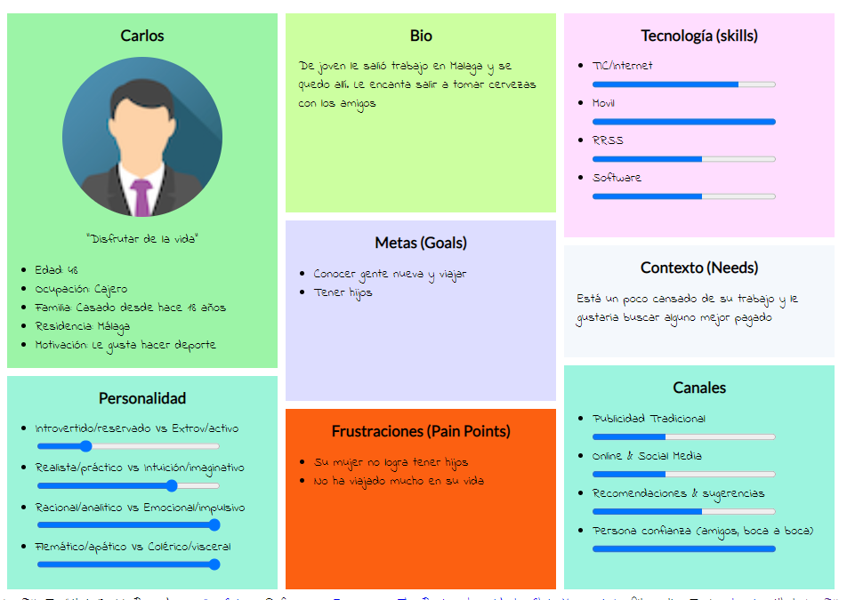
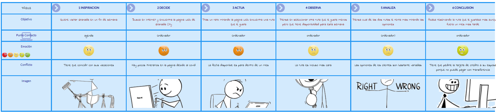

# DIU21
Prácticas Diseño Interfaces de Usuario 2020-21 (Tema: Turismo) 

Grupo: DIU3_We-Robot.  Curso: 2020/21 

Proyecto: 
>>> Tapeo por Granada

Descripción: 
>>> El proyecto se basa en la idea de la Ruta de la Tapa en Granada. Esta app
favorecerá tanto el turismo de Granada como a la hostelería granadina.
La app mostrará un mapa de la ciudad granadina con los diferentes puntos a visitar
de la ruta. Cada punto de la ruta corresponde a un restaurante.

Logotipo: 
>>> Opcionalmente si diseña un logotipo para su producto en la práctica 3 pongalo aqui

Miembros
 * :bust_in_silhouette:   Pablo Rodriguez Avila     :octocat:     
 * :bust_in_silhouette:  Ahmed El Moukhtari Koubaa     :octocat:

----- 

# Proceso de Diseño 

## Paso 1. UX Desk Research & Analisis 

1.a Competitive Analysis

 
-----

>>> Describe brevemente características de las aplicaciones que tienes asignadas, y por qué has elegido una de ellas (150-300 caracteres) 

Para realizar la comparación hemos seleccionado la página granada-city-tour. Dicha
elección se ha basado principalmente en algunos de los requisitos que se nos solicitaban en
el guión de dicha práctica; como: ser una plataforma que ofrece actividades de ocio, reserva
de entradas, tour guiados, etc.
Además, la valoración final de Granada City Tour es bastante alta, aunque la de París sea
un punto más alto, nos quedamos con Granada porque es una alternativa local que
podemos explotar más a la hora de estudiarla.
En cuanto a las alternativas, hemos seleccionado páginas muy similares para localizaciones
diferentes en otros países por ser una alternativa global

1.b Persona
 
 
-----

>>> Comenta brevemente porqué has seleccionado a esas personas y sube una captura de pantalla de su ficha  (80-150 caracteres)

Hemos creado aleatoriamente a dos personajes, uno de ellos es Carlos y otro es Heather.
Carlos es español está felizmente casado y no tiene hijos mientras que Heather es inglesa
con 3 hijos y ,además, divorciada. Teniendo en cuenta la diferencia de rasgos personales
de cada personaje, podremos obtener una información más relevante y valiosa.

1.c User Journey Map

Journey Map de Carlos
 
Journey Map de Heather
 
----

>>> Comenta brevemente porqué has escogido estas dos experiencias de usuario (y si consideras que son habituales) (80-150 caracteres) 
- Heather: es abogada y tiene unos días libres, viaja a Granada con sus niños pero al
llegar un caso que llevaba se complica y su cliente requiere de su atención. Por no
suspender sus vacaciones Heather decide teletrabajar hasta volver. En Granada
Heather decide ir con sus 3 hijos a realizar un city tour, pero no tiene mucho tiempo,
usa Granada-City-Tour.
- Carlos: es cajero y decide visitar Granada un fin de semana. Carlos mira en su
agenda y selecciona algún fin de semana que tenga libre. Indagando, Carlos
encuentra la web de Granada-City-Tour aunque hay pocos itinerarios en la página
debido al covid. Tras un rato mirando encuentra una ruta que le gusta pero la fecha
disponible es para dentro de un mes. Como a Carlos le gustaría irse pronto, busca
otra ruta más próxima, lo malo es que es más cara. Acaba analizando cual de las
dos rutas le conviene más mirando opiniones de los clientes. Finalmente se decanta
por la primera ruta aunque sea dentro de un mes. Por otro lado, a la hora de pagar
Carlos tiene algún problema debido a los escasos métodos de pago en la página

1.d Usability Review
 
----
>>>  Revisión de usabilidad: (toma los siguientes documentos de referncia y verifica puntos de verificación de  usabilidad
>>>> SE deben incluir claramente los siguientes elementos
>>> - Enlace al documento:  (sube a github el xls/pdf) 
>>> - Valoración final (numérica): 72
>>> - Comentario sobre la valoración:  (60-120 caracteres)
Hemos realizado dicha review desde el punto de vista de Heather al hacer uso de granadacity-tour. Obtenemos como resultado final: “72 Good”, lo cual concuerda con el perfil de
Heater ya que es una mujer de 32 años, inglesa, que se maneja bien con redes sociales,
páginas web, etc. Tal vez echemos en falta un mecanismo de búsqueda que nos permita
encontrar lo que buscamos más rápidamente y algunas recomendaciones populares para
reducir el tiempo de decisión. También se puede destacar la facilidad para poder volver al
inicio de la página o para poder añadir al carrito las reservas que queremos

## Paso 2. UX Design  

 2.a Feedback Capture Grid / EMpathy map / POV
----

>>> Comenta con un diagrama los aspectos más destacados a modo de conclusion de la práctica anterior,

 Interesante | Críticas     
| ------------- | -------
  Preguntas | Nuevas ideas
  
    
>>> ¿Que planteas como "propuesta de valor" para un nuevo diseño de aplicación para economia colaborativa ?
>>> Problema e hipótesis
>>>  Que planteas como "propuesta de valor" para un nuevo diseño de aplicación para economia colaborativa te
>>> (150-200 caracteres)

 2.b ScopeCanvas
----
>>> Propuesta de valor 
>>> 
El proyecto se basa en la idea de la Ruta de la Tapa en Granada. Esta app
favorecerá tanto el turismo de Granada como a la hostelería granadina. Estará
enfocada en personas no residentes en Granada, principalmente estará destinada a
extranjeros provenientes de Europa o Asia.
La app mostrará un mapa de la ciudad granadina con los diferentes puntos a visitar
de la ruta. Cada punto de la ruta corresponde a un restaurante. Esta ruta empezará
en la Chana y terminará en el Zaidín de manera que los visitantes acabarán
recorriendo la ciudad. La ruta contendrá restaurantes situados en puntos de interés
turístico como la Alhambra o el Albayzín, fomentando así tanto el interés
gastronómico como cultural.
El usuario al completar la ruta podrá dejar comentarios acerca de ella y haciendo
propuestas para mejorarla. Esta propuesta puede contener la ruta modificada oincluso crear una de cero. Estas propuestas se añadirán a las sección de Rutas de
la Comunidad.
Frecuentemente se ofrecerán además de las rutas oficiales, rutas basadas en estas
pero con modificaciones, con nuevas paradas o sin algunas antiguas, por ejemplo,
si se prevé un evento interesante se podría cambiar la ruta para pasar cerca de
dicho evento.

 2.b Tasks analysis 
-----

>>> Definir "User Map" y "Task Flow" ... 

 2.c IA: Sitemap + Labelling 
----

>>> Identificar términos para diálogo con usuario  

Término | Significado     
| ------------- | -------
Inicio  | Contiene información sobre rutas yreseñas, nos redirige a accionesrelacionadas con estas.
Rutas disponibles | Contiene información sobre las rutas que se pueden realizar actualmente
Mis rutas | Gestiona las rutas del usuario
Mis reseñas | Gestiona las reseñas del usuario
Rutas oficiales | Muestra las rutas creadas por el sistema
Rutas de la comunidad | Muestra las rutas creadas por losusuarios y permite llevar acciones sobre ellas
Mapa | Muestra gráficamente las rutas, es un mapa político con líneas y puntos, donde los puntos son restaurantes de tapas y las líneas caminos para llegar de un nodo a otro
Seleccionar ruta | Permite escoger la ruta sobre la que se llevarán a cabo las acciones
Añadir ruta | Añade una ruta a las rutas de usuario
Compartir | Genera un mensaje con información relevante sobre una ruta, dicho mensaje se puede enviar por otras aplicaciones (Whatsapp, Telegram, Instagram, Facebook, etc)
Crear ruta | Permite al usuario crear una ruta propia
Rutas en curso | Muestra las rutas que ha comenzado el usuario, puede haber más de una iniciada a la vez
Rutas completadas | Gestiona las rutas que el usuario ya completó
Desde 0 | Crea una ruta completamente nueva, desde cero
Desde una ya existente | Crea una ruta basándose en otra ruta que ya existe, añadiendo nuevos nodos, eliminando viejos, nuevas uniones, etc
Lista de rutas completadas | Muestra una lista con todas las rutas que el usuario haya completado
Mostrar todas rutas | Muestra todas las rutas del usuario
Eliminar | Permite eliminar una ruta
Nueva reseña | Crea una nueva reseña
Eliminar reseña | Elimina una reseña anterior
Compartir reseña | Genera un mensaje con toda la información relativa a una reseña y permite enviarlo por distintos medios(Whatsapp, Telegram, Instagram, Facebook, etc)
Modificar reseña | Modifica el contenido de una reseña previa
  

 2.d Wireframes
-----

>>> Plantear el  diseño del layout para Web/movil (organización y simulación ) 

## Paso 3. Mi UX-Case Study (diseño)

 3.a Moodboard
-----

>>> Plantear Diseño visual con una guía de estilos visual (moodboard) 
>>> Incluir Logotipo
>>> Si diseña un logotipo, explique la herramienta utilizada y la resolución empleada. ¿Puede usar esta imagen como cabecera de Twitter, por ejemplo, o necesita otra?

  3.b Landing Page
----

>>> Plantear Landing Page 

 3.c Guidelines
----

>>> Estudio de Guidelines y Patrones IU a usar 
>>> Tras documentarse, muestre las deciones tomadas sobre Patrones IU a usar para la fase siguiente de prototipado. 

  3.d Mockup
----

>>> Layout: Mockup / prototipo HTML  (que permita simular tareas con estilo de IU seleccionado)

 3.e ¿My UX-Case Study?
-----

>>> Publicar my Case Study en Github..
>>> Documente y resuma el diseño de su producto en forma de video de 90 segundos aprox

## Paso 4. Evaluación 

 4.a Caso asignado
----

>>> Breve descripción del caso asignado con enlace a  su repositorio Github

 4.b User Testing
----

>>> Seleccione 4 personas ficticias. Exprese las ideas de posibles situaciones conflictivas de esa persona en las propuestas evaluadas. Asigne dos a Caso A y 2 al caso B
 

| Usuarios | Sexo/Edad     | Ocupación   |  Exp.TIC    | Personalidad | Plataforma | TestA/B
| ------------- | -------- | ----------- | ----------- | -----------  | ---------- | ----
| User1's name  | H / 18   | Estudiante  | Media       | Introvertido | Web.       | A 
| User2's name  | H / 18   | Estudiante  | Media       | Timido       | Web        | A 
| User3's name  | M / 35   | Abogado     | Baja        | Emocional    | móvil      | B 
| User4's name  | H / 18   | Estudiante  | Media       | Racional     | Web        | B 

. 4.c Cuestionario SUS
----

>>> Usaremos el **Cuestionario SUS** para valorar la satisfacción de cada usuario con el diseño (A/B) realizado. Para ello usamos la [hoja de cálculo](https://github.com/mgea/DIU19/blob/master/Cuestionario%20SUS%20DIU.xlsx) para calcular resultados sigiendo las pautas para usar la escala SUS e interpretar los resultados
http://usabilitygeek.com/how-to-use-the-system-usability-scale-sus-to-evaluate-the-usability-of-your-website/)
Para más información, consultar aquí sobre la [metodología SUS](https://cui.unige.ch/isi/icle-wiki/_media/ipm:test-suschapt.pdf)

>>> Adjuntar captura de imagen con los resultados + Valoración personal 

 4.d Usability Report
----

>> Añadir report de usabilidad para práctica B (la de los compañeros)

>>> Valoración personal 

## Paso 5. Evaluación de Accesibilidad  

  5.a Accesibility evaluation Report 
----

>>> Indica qué pretendes evaluar (de accesibilidad) sobre qué APP y qué resultados has obtenido 

>>> 5.a) Evaluación de la Accesibilidad (con simuladores o verificación de WACG) 
>>> 5.b) Uso de simuladores de accesibilidad 

>>> (uso de tabla de datos, indicar herramientas usadas) 

>>> 5.c Breve resumen del estudio de accesibilidad (de práctica 1) y puntos fuertes y de mejora de los criterios de accesibilidad de tu diseño propuesto en Práctica 4.

## Conclusión final / Valoración de las prácticas

>>> (90-150 palabras) Opinión del proceso de desarrollo de diseño siguiendo metodología UX y valoración (positiva /negativa) de los resultados obtenidos  

